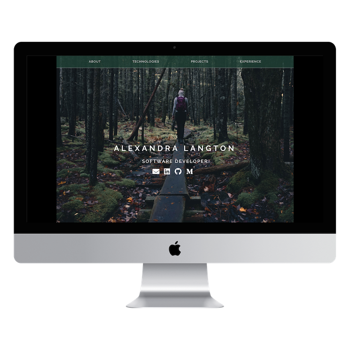

# Alexandra Langton's Portfolio

### Hello and welcome!

If you'd like to have a look at my site locally, here's a quick guide to get you started:

```js
git clone https://github.com/alexandralangton/Portfolio.git
cd Portfolio
npm install
npm run start-dev
```

A local version of this site will then be accessible at http://localhost:8000/

You can visit the deployed version at www.alexandralangton.com

If you have any feedback I'd love to hear from you! Thanks for checking out this repo.


